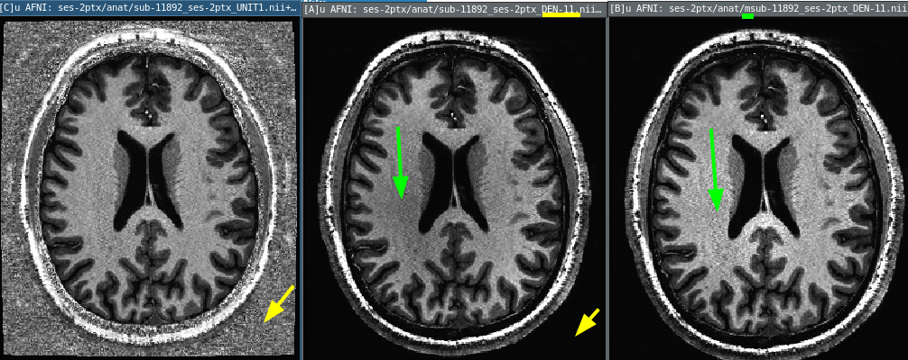

# Remove background noise and bias correct MP2RAGE acquisitions from 7T PLUS.
Entrypoint is `010_mp2rage_unicort.bash`

  - runs `RobustCombination` from https://github.com/JosePMarques/MP2RAGE-related-scripts
  - runs SPM's unicort
  - saves output as T1w for eg. fmriprep



## BIDS input files
Input should be BIDS formated nifti files. Like
```
BIDS/sub-12199/ses-1ptx/anat/
├── sub-12199_ses-1ptx_inv-1_MP2RAGE.nii.gz
├── sub-12199_ses-1ptx_inv-2_MP2RAGE.nii.gz
└── sub-12199_ses-1ptx_UNIT1.nii.gz
```

## Modifications

For default "all" files argument to `denoise.m` and `spm_unicort.m` used by `010_mp2rage_unicort.bash`,
see `private/missing_table.m` use of `private/t_add_subsess.m` for identifying which files are missing/what sessions need to be run.
Customize this function to pull out "participant id + session id" from input file globs.


## Global variables
set environmental varabiles to change settings. eg `export DRYRUN=1` in shell before running to see what would happen without writting any new files.

Options are

| varaible | desc |
| -------- | ---- |
| `MP2RAGE_REGULARIZATION`      | default `11`, use `0` for interactive|
| `BIDS=${BIDS:-../Data/bids/}` | path to BIDS root |
| `REDO`                        | default empty skips existing files |
| `DRYRUN`                      | when non-empty will report what would be run but wont actually do it |
| `SPM_TOOLBOX`                 | where to find spm. default: `/opt/ni_tools/spm`|
| `MP2RAGE_TOOLBOX`             | default `/opt/ni_tools/matlab_toolboxes/MP2RAGE-related-scripts`|

TODO: TOOLBOX paths default in `~/.cache` & `system('git clone')` if MIA

## denoise
Appends `-DEN*` to input filename.

Can run for an individual file like

```sh
matlab -r "denoise('../Data/BIDS/sub-1/anat/sub-1_UNIT1.nii.gz')"
```

Requires `inv-1` and `inv-2` `_MP2RAGE` pairs to the `UNIT1.nii.gz` input file.
```matlab
     MP2RAGE.filenameINV1=regexprep(uni, '_UNIT1.nii.gz', '_inv-1_MP2RAGE.nii.gz');
     % Inversion Time 2 MP2RAGE T1w image; eg 'data/MP2RAGE_INV2.nii';
     MP2RAGE.filenameINV2=regexprep(uni, '_UNIT1.nii.gz', '_inv-2_MP2RAGE.nii.gz');
```

## unicort

Prefixes `m*` to input filename.

SPM input must be uncompressed nifti files. Using `nii.gz` inputs will give hard-to-debug errors.
Input should be output of denoising.

```sh
matlab -r "denoise('../Data/BIDS/sub-1/anat/sub-1_DEN-11.nii')"
```
